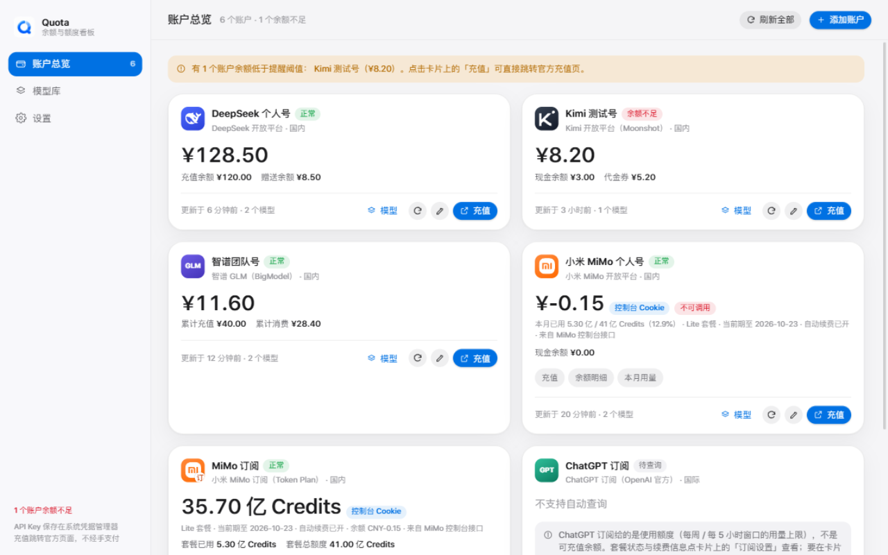
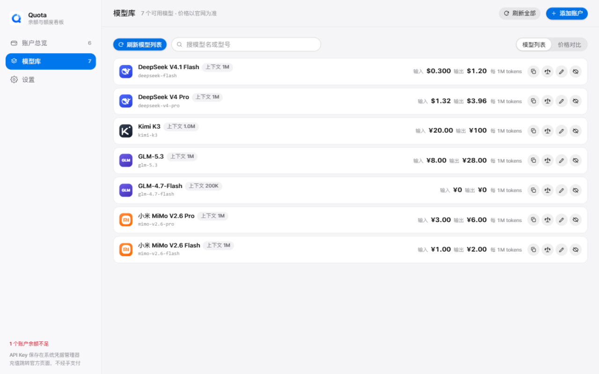
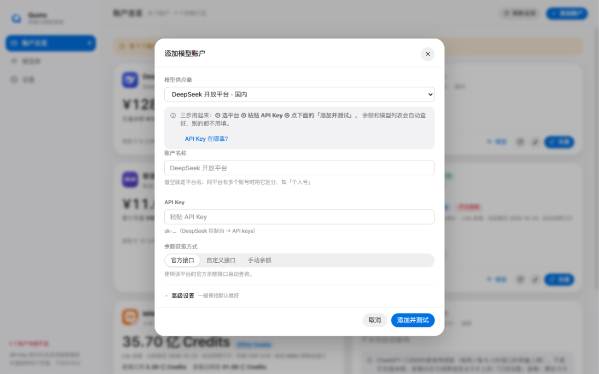
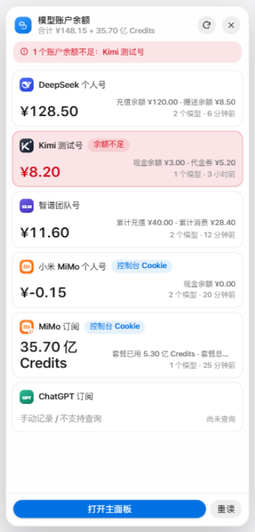
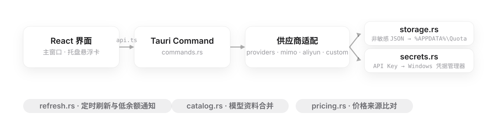
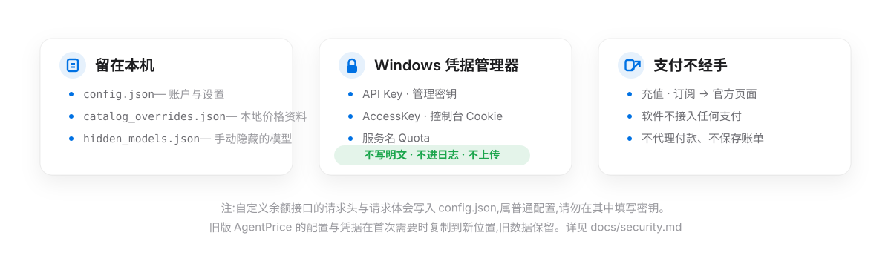

<p align="center">
  <picture>
    <source media="(prefers-color-scheme: dark)" srcset="assets/readme/hero-dark.svg">
    
  </picture>
</p>

Quota 把散落在各服务商控制台里的 AI 账户，放进同一个桌面窗口和系统托盘：一眼看到余额、套餐额度与用量，设置自动刷新和低余额提醒。充值与订阅只跳转服务商官方页面，软件不经手任何支付。

## Screenshots

<p align="center">
  <picture>
    <source media="(prefers-color-scheme: dark)" srcset="assets/readme/screenshot-main-dark.png">
    
  </picture>
  <br>
  <picture>
    <source media="(prefers-color-scheme: dark)" srcset="assets/readme/screenshot-models-dark.png">
    
  </picture>
  <br>
  <picture>
    <source media="(prefers-color-scheme: dark)" srcset="assets/readme/screenshot-add-account-dark.png">
    
  </picture>
  <br>
  <picture>
    <source media="(prefers-color-scheme: dark)" srcset="assets/readme/screenshot-tray-dark.png">
    
  </picture>
  <br>
  <sub>自上而下：账户总览 · 模型库 · 添加账户表单 · 系统托盘悬浮卡。截图由本地 mock 预览渲染，数据为演示数据；实际界面以构建版本为准。</sub>
</p>

## Features

- **多账户余额汇总** — 按服务商能力显示余额分项、套餐额度或用量，一屏看完所有账户。
- **极简添加流程** — 只填平台、账户名称、API Key、余额获取方式 4 项，配三步教程；其余收进「高级设置」。
- **定时刷新与低余额通知** — 低于提醒阈值的账户会标红并弹系统通知，托盘悬浮卡常驻桌面角落。
- **查询方式可退化** — 官方接口不可用时可选自定义接口或手动余额，任何服务商都能参与低余额通知。
- **本地优先** — 配置保存在 `%APPDATA%\Quota\`；API Key、管理密钥、AccessKey、控制台 Cookie 只进 Windows 凭据管理器，不写明文、不进日志、不上传。
- **模型资料与价格比对** — 内置模型列表和可编辑的本地价格资料库；价格必须从官方定价页核实，查不到一律标「待核实」，绝不编数字。
- **充值只跳官方** — 不接入支付，所有充值、订阅按钮都只打开服务商官方页面。

## How it works

<p align="center">
  <picture>
    <source media="(prefers-color-scheme: dark)" srcset="assets/readme/how-it-works-dark.svg">
    
  </picture>
</p>

前端通过 `src/lib/api.ts` 调用 Tauri 命令层，供应商逻辑在 Rust 侧；定时刷新由 `refresh.rs` 触发低余额通知，模型资料由 `catalog.rs` 合并内置数据与本地覆盖。详见[架构](docs/architecture.md)。

## Supported providers

以下是当前「添加账户」列表里可见的 6 个服务商，能力根据代码路径整理；接口可用性仍取决于服务商和你的账户权限。

| Provider | Balance | Usage / quota | Method |
| --- | --- | --- | --- |
| DeepSeek | ✓ | — | API Key，余额接口 |
| Kimi (Moonshot) | ✓ | — | API Key，余额接口 |
| 智谱 GLM | ✓ | — | API Key，未收录在官方文档的账户报表接口 |
| 小米 MiMo 按量 | ✓ | 本月用量 | 控制台 Cookie |
| 小米 MiMo Token Plan | 套餐余量 | 本月用量 | 控制台 Cookie |
| ChatGPT 订阅 | — | — | 当前仅提供订阅页面入口 |

阿里云百炼、硅基流动、OpenAI Platform、Anthropic、Gemini 的代码定义保留，但目前不在添加账户列表。详情见[供应商能力](docs/providers.md)。

## Security and data

<p align="center">
  <picture>
    <source media="(prefers-color-scheme: dark)" srcset="assets/readme/security-dark.svg">
    
  </picture>
</p>

账户设置保存在 `%APPDATA%\Quota\`；凭据字段保存在系统凭据管理器的 `Quota` 服务下。旧版 `AgentPrice` 的配置与凭据在首次需要时复制到新位置，旧数据保留。Quota 不处理支付。自定义接口字段的注意事项见[安全与迁移说明](docs/security.md)。

## Install and run

仓库源码不包含预编译安装包。要在 Windows 本地构建，请安装 Node.js、Rust GNU 工具链和 WebView2 运行时，然后运行：

```powershell
npm ci
npm run tauri build
```

构建结果位于 `src-tauri/target/release/quota.exe` 与 `src-tauri/target/release/bundle/nsis/`。Windows GNU、NSIS 和 `WebView2Loader.dll` 的已知限制见 [Windows 构建说明](docs/build-windows.md)。开发运行与验证命令见[开发指南](docs/development.md)。

## Documentation

| 文档 | 内容 |
| --- | --- |
| [架构](docs/architecture.md) | 前端调用链、命令层与模块划分 |
| [供应商能力](docs/providers.md) | 各服务商的查询方式与限制 |
| [模型资料库](docs/model-catalog.md) | 价格取数规则与核实纪律 |
| [安全与迁移说明](docs/security.md) | 凭据存储与自定义接口注意事项 |
| [Windows 构建说明](docs/build-windows.md) | GNU 工具链、NSIS 与已知限制 |
| [开发指南](docs/development.md) | 开发运行与验证命令 |

## Contributing

新增供应商或修复查询接口前，请读[贡献指南](CONTRIBUTING.md)、[架构](docs/architecture.md)和[供应商能力](docs/providers.md)。模型价格必须依据官方来源核实，规则见[模型资料库](docs/model-catalog.md)。

## Roadmap

- 将供应商逻辑按适配器逐步模块化。
- 设计能够区分 Balance、Credit、Quota、Usage 的统一指标模型。
- 调整主导航，让余额与额度总览更突出。

## License

尚未选择开源许可证。仓库公开可读不代表已授予再分发或修改许可；贡献和复用前请等待许可证确定。
