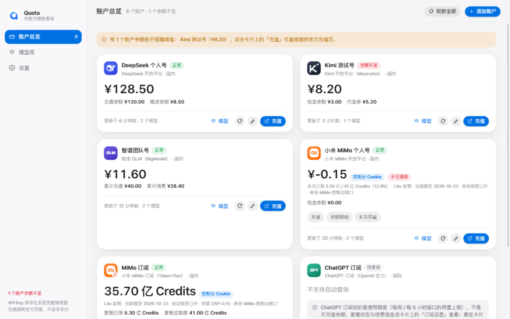
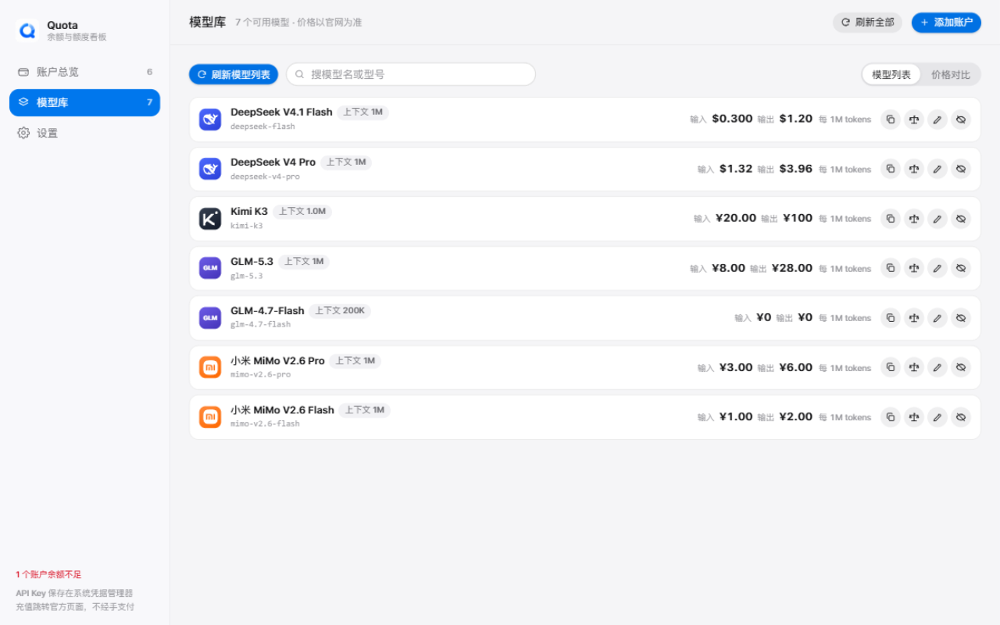
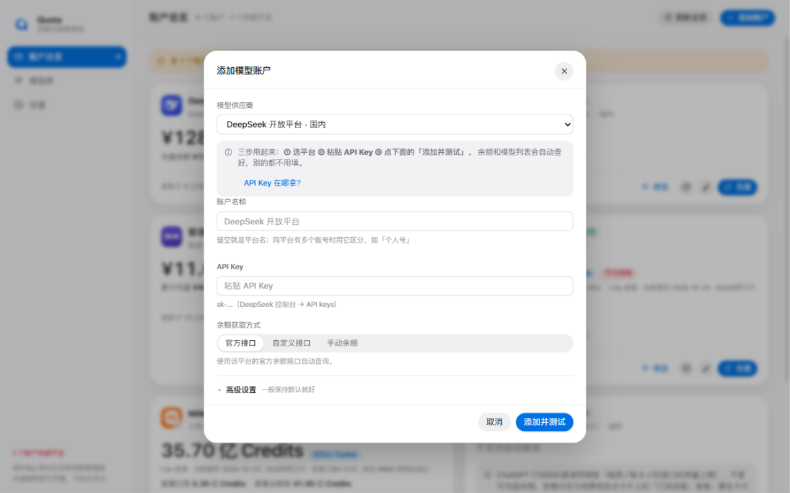
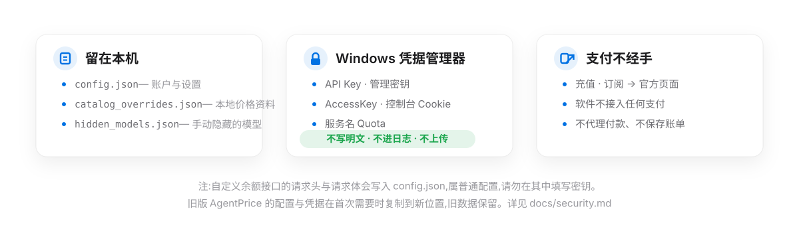

<p align="center">
  <picture>
    <source media="(prefers-color-scheme: dark)" srcset="assets/readme/hero-dark.svg">
    
  </picture>
</p>

Quota 把散落在服务商控制台里的 AI 账户放进一个桌面窗口：查看余额和订阅额度，追踪 Token 用量，设置自动刷新与低余额提醒。充值与订阅按钮只打开官方页面，软件不经手支付。

**Windows 10+ · macOS Apple Silicon 本地构建 · 本地优先 · 浅色 / 深色模式 · 六种账户类型**

[支持账户](#支持账户) · [备份与迁移](#备份与迁移) · [构建与开发](#构建与开发) · [文档](#文档)

## 当前进展

当前功能迭代为 **1.0.1000**（包版本 `1.0.1000`，2026-10-06），新增可选采集频率、共享目录账户展示资料同步、macOS 天梯网络兼容与备份入口简化。Windows 最近已生成的安装包仍为 1.0.0900；新版需在 Windows 原生构建，不能把源码升版当作安装包交付。

**1.0.1000 Apple Silicon DMG 已本地生成**，整包临时签名、DMG 完整性及隔离配置启动存活检查通过。尚未公开发布，未公证；真实 iCloud / OneDrive 云端交换及覆盖升级未验证。详见 [本次交付说明](docs/release-1.0.1000.md)。

`main` 已包含 **1.0.0900 的完整功能源码、验证脚本和文档**。2026-10-05 在 Apple Silicon Mac 上生成了原生 arm64 的 `Quota.app` 和 `Quota_1.0.0900_aarch64.dmg`，前端类型检查、生产构建、Rust 检查和逻辑自检（7/7）通过，整包临时签名与 DMG 完整性校验通过。macOS 安装包尚未公开发布，未做 Apple Developer ID 签名或公证；真实账户连接、钥匙串读写及跨平台迁移尚未完成实机验收，Intel / Universal 包未构建。

本次更新：

- **采集与共享同步（1.0.1000）**：Token 频率可选；账户展示资料通过用户指定的共享目录同步，不包含任何登录凭据；修复 ZCode 任务索引误报，统一备份入口并移除飞书调用。
- **macOS 天梯兼容（1.0.1000）**：支持系统代理与官方文档网络回退；无汇率时按原币种显示，不丢弃美元型号，未知价格仍不猜测。
- **小米登录复用**：先连接小米按量或订阅账户，添加另一种时选择已连接账号，无需再次扫码；多个小米账号可分别选择。
- **微信登录修复**：小米官方登录窗口允许微信授权跳转。真实账号扫码流程仍需实机验证。
- **完整迁移与选择导入**：普通 JSON 保存账户资料与统计；加密备份另含密钥和完整连接配置。导入前预览，可逐账户、逐类别选择，未选内容保留。

详见 [1.0.1000 迭代说明](docs/optimization-2026-10-06.md)、[1.0.0900 交付说明](docs/release-1.0.0900.md) 和 [账户连接与数据迁移](docs/data-migration.md)。

## 能做什么

| 页面 | 用途 |
| --- | --- |
| **账户总览** | 余额、套餐额度、低余额提醒与趋势；累计充值、累计消费分别展示，官方缺失时可手动补全 |
| **模型库** | 查看模型资料与价格来源，隐藏或恢复模型 |
| **AI 模型天梯** | 查看排名、价格与性能图，筛选和对比模型；自动核实十家厂商的确定性官方价格表 |
| **Token 活动** | 汇总本机 Codex、智谱 ZCode 及手动配置的 DeepSeek Harness 用量，按日期、设备、模型、Agent 和工具筛选 |
| **设置** | 调整刷新、通知、隐私与活动同步，导出备份并选择导入内容 |

添加账户采用三步中文引导：选择平台 → 填入 API Key 或连接登录 → 保存。账户名称可选，其余参数收进「高级设置」。接口查询失败时可重试、打开官网或改用手动余额；单击系统托盘打开主窗口。

余额趋势只反映已记录的数据，耗尽时间为估算。官方未提供的累计充值或消费保持未知，不用充值减余额反算。模型价格只接受可核实的官方来源，保留单位、条件、来源与核实时间；查不到就显示「待核实」，不猜数字。

## 支持账户

「添加账户」当前显示以下六种类型。账户余额适配与天梯厂商范围分别维护，查询能力取决于服务商接口及账户权限。

| 账户类型 | 查看内容 | 连接方式 |
| --- | --- | --- |
| DeepSeek | 余额 | API Key |
| Kimi / Moonshot | 余额 | API Key |
| 智谱 GLM | 余额 | API Key；使用未收录于官方文档的账户报表接口 |
| 小米 MiMo 按量 | 余额、本月用量 | 隔离的官方登录窗口 |
| 小米 MiMo 订阅 / Token Plan | 套餐余量、本月用量 | 官方登录，可复用按量账户连接 |
| ChatGPT 订阅 | Codex 短期及每周额度 | 显式连接本机 Codex 登录 |

**ChatGPT 卡片展示的是订阅内 Codex 额度，不是网页聊天额度。** Quota 不复制或刷新 Codex token。其他供应商的适配定义部分保留在代码中，目前不显示在添加列表；详见 [供应商能力](docs/providers.md)。

## 界面预览

<p align="center">
  <picture>
    <source media="(prefers-color-scheme: dark)" srcset="assets/readme/screenshot-main-dark.png">
    
  </picture>
  <br>
  <picture>
    <source media="(prefers-color-scheme: dark)" srcset="assets/readme/screenshot-models-dark.png">
    
  </picture>
  <br>
  <picture>
    <source media="(prefers-color-scheme: dark)" srcset="assets/readme/screenshot-add-account-dark.png">
    
  </picture>
  <br>
  <sub>截图为旧版 mock 预览，均使用演示数据，用于展示整体设计；当前界面以实际构建版本为准。</sub>
</p>

## 备份与迁移

在「设置 → 备份与迁移」使用统一的「导出」或「导入」入口。默认导出不含登录信息的 JSON；勾选「包含登录信息」后设置密码，生成加密备份。两种格式都包含账户资料、应用设置、模型资料、隐藏列表、余额历史与已采集 Token 活动。

| 方式 | 登录信息与连接配置 | 适用情况 |
| --- | --- | --- |
| **默认备份（JSON）** | 不含密钥或 Cookie；省略备注、自定义请求、连接 URL 和本机采集 / 同步路径 | 迁移账户资料和统计，或自行分析数据 |
| **包含登录信息（加密）** | 包含完整账户配置及凭据库中的 API Key、AccessKey、管理密钥和小米 Cookie；不含 Codex token | 连同连接信息迁移；恢复需要原密码 |

导入流程：

1. 选择文件；加密备份填写原密码，普通 JSON 无需密码。
2. 点击「读取内容」，选择具体账户及是否导入登录信息；需要时展开「自定义导入范围」调整其他类别。
3. 点击「导入所选内容」。按账户 ID 合并，其他账户与未选类别保留；历史和活动去重，写入失败时尝试回滚并报告结果。

普通 JSON 与加密备份采用平台无关格式，macOS 构建已包含同一迁移模块和 Keychain 后端。**构建通过不等于迁移与钥匙串读写已完成实机验证。** 新设备上的小米 Cookie 可能需要重新登录；ChatGPT 需连接新设备的 Codex。日志路径与共享目录应在新设备重新设置。飞书云同步入口与自动调用已移除，旧文件仍可通过统一导入入口合并。

加密备份使用 AES-256-GCM，密码经 PBKDF2-HMAC-SHA256 派生，不落盘。支持旧版导出，文件大小上限为 256 MB；详细兼容规则见 [数据迁移](docs/data-migration.md)。

## Token 活动与跨设备同步

Quota 只读取已保留的本地用量，保存指标，不保存对话正文或工具参数。缓存与推理是输入 / 输出的子项，不重复加到总 Token。活动统计不等于厂商账单或订阅剩余额度。

「设置 → Token 活动」可选择自动采集间隔（5 秒至 15 分钟，默认 30 秒），或关闭自动采集；仅在应用运行时执行。共享目录交换最低间隔为 5 分钟，长采集间隔时随下一次采集执行。

在「设置 → 跨设备同步」选择各设备共用的 **iCloud Drive、OneDrive 或 NAS** 文件夹。除 Token 指标外，可同步账户名称、同步方式、手动金额、提醒阈值和余额/订阅快照。账户资料按最新编辑合并，余额按最新查询时间取快照，不累加；删除仅影响本机。**自动同步绝不包含 API Key、AccessKey、管理密钥、Cookie、Codex token、连接 URL、自定义请求、备注或原始响应。** 新设备需单独配置登录信息才能主动查询。详见 [共享目录账户同步](docs/account-sync.md)。

目录传输由已有云盘客户端或 NAS 完成，Quota 不自动猜测云盘路径，也不能确认文件已上传到云端。未选择目录时只在本机保存；Token 事件按独立设备 UUID 去重。微信云同步尚未实现，小米微信登录不提供云同步功能。

## 数据与安全

<p align="center">
  <picture>
    <source media="(prefers-color-scheme: dark)" srcset="assets/readme/security-dark.svg">
    
  </picture>
</p>

- 配置和统计保存在系统配置目录：Windows 为 `%APPDATA%\Quota\`，macOS 为 `~/Library/Application Support/Quota/`。API Key、AccessKey、管理密钥和小米 Cookie 使用系统凭据库的 `Quota` 服务：Windows 凭据管理器 / macOS Keychain；macOS 真实凭据读写尚未完成实机验收。用户主动导出的加密备份可包含这些凭据。
- **自定义接口请求头与请求体会写入 `config.json`。不要在这些字段填写密钥；它们不受凭据管理器保护。** 普通 JSON 导出省略这些字段，加密备份可保存完整配置。
- 从旧版 AgentPrice 升级时，逐项复制新位置缺失的配置及所需凭据，保留旧数据。
- 数据采集以本机为主；查询余额、获取排名和核实价格会访问对应服务。统计同步只在用户选择共享目录后启用。
- 不接入支付，充值和订阅入口只打开官方页面。

详见 [安全规则与旧版迁移](docs/security.md)。

## 构建与开发

仓库不包含预编译安装包，本地交付包尚未上传为公开 Release。`main` 当前对应 `1.0.0900`；Windows 和 macOS 分别在对应系统上原生构建。

### Windows

Windows 构建需 Node.js、Rust GNU 工具链和 WebView2 运行时：

```powershell
git clone https://github.com/Sharanie0612/Quota.git
Set-Location Quota
npm ci
npm run tauri dev
```

构建安装包前，退出正在运行的 `quota.exe`，并确保使用 rustup GNU 工具链自带的 MinGW，避免系统中的旧 MinGW：

```powershell
$env:Path = "$env:USERPROFILE\.rustup\toolchains\stable-x86_64-pc-windows-gnu\lib\rustlib\x86_64-pc-windows-gnu\bin;$env:USERPROFILE\.cargo\bin;$env:Path"
npm run tauri build
```

产物位于 `src-tauri/target/release/quota.exe`（便携版）和 `src-tauri/target/release/bundle/nsis/`（安装包）。`WebView2Loader.dll` 必须随安装包携带；NSIS 工具链首次下载可能需要代理。详见 [Windows 构建说明](docs/build-windows.md)。

### macOS（Apple Silicon）

需 Node.js、Rust stable 和 Xcode Command Line Tools；本次构建使用 `aarch64-apple-darwin` 工具链。安装依赖后，以命令行配置覆盖生成 App 和 DMG，排除 Windows 专用 DLL，并完成整包临时签名：

```bash
npm ci
npm run tauri -- build --bundles app,dmg --config '{"bundle":{"resources":[],"macOS":{"signingIdentity":"-","hardenedRuntime":false}}}'
```

App 位于 `src-tauri/target/release/bundle/macos/Quota.app`，当前 DMG 位于 `src-tauri/target/release/bundle/dmg/Quota_1.0.1000_aarch64.dmg`。默认配置仍用于 Windows NSIS，macOS 构建需使用上述覆盖命令。

打开 DMG，将 Quota 拖入「应用程序」，随后推出磁盘映像，日常只打开 `/Applications/Quota.app`。源码构建交付后，将 `bundle/macos/Quota.app` 副本移到废纸篓，避免应用搜索出现两份；保留 DMG 即可再次安装。

当前包使用 ad-hoc 临时签名，未公证，首次打开可能被 macOS 拦截；确认来源后，可在「系统设置 → 隐私与安全性」中允许打开。详细构建命令、校验结果和平台限制见 [macOS 构建说明](docs/build-macos.md)。

### 验证

适用验证命令：

```powershell
npm run typecheck
npm run build
node scripts/verify-logic.cjs
Set-Location src-tauri
cargo check
```

本机 Windows GNU 环境中 `cargo test` 存在 WinRT DLL 加载限制，不作为验收手段。统计等专项检查使用对应 Rust example；纯文档变更核对内容、链接和差异格式，无需递增产品版本。

## 文档

| 文档 | 内容 |
| --- | --- |
| [账户连接与数据迁移](docs/data-migration.md) | 小米登录复用、导出范围、选择导入与 Mac 迁移边界 |
| [1.0.0900 交付说明](docs/release-1.0.0900.md) | 本次功能、实际验证与未验证项 |
| [Token 活动与同步](docs/activity-stats.md) | 数据口径、历史范围、共享目录与去重协议 |
| [架构](docs/architecture.md) | 前端调用链、Rust 命令与模块划分 |
| [供应商能力](docs/providers.md) | 查询方式与接口限制 |
| [模型资料库](docs/model-catalog.md) | 官方价格来源与核实纪律 |
| [安全规则](docs/security.md) | 凭据存储、自定义接口和旧版迁移 |
| [Windows 构建说明](docs/build-windows.md) | GNU 工具链、NSIS 与 DLL 要求 |
| [macOS 构建说明](docs/build-macos.md) | Apple Silicon 构建、临时签名、DMG 校验与安装 |
| [开发指南](docs/development.md) | 开发运行与验证命令 |

文档与本次功能源码一并维护；历史交付说明记录当时的行为与验收，不代表当前版本状态。

## 贡献与许可

提交修复前请阅读 [贡献指南](CONTRIBUTING.md) 和安全规则。PR 应写清用户可见变化、验证结果与兼容限制；不要提交凭据、个人配置、真实账单或未经官方核实的价格。

项目尚未选择开源许可证。仓库公开可读不代表已授予修改或再分发许可。
