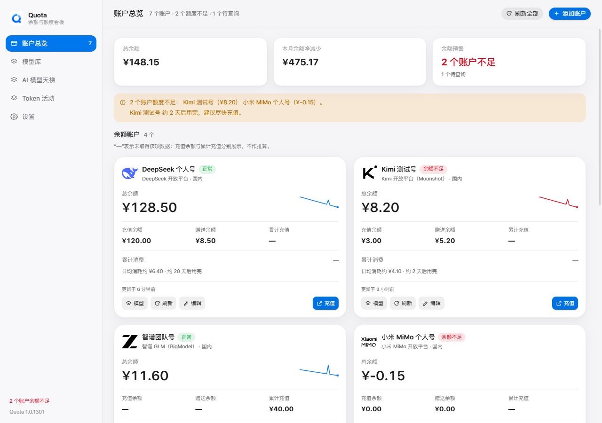
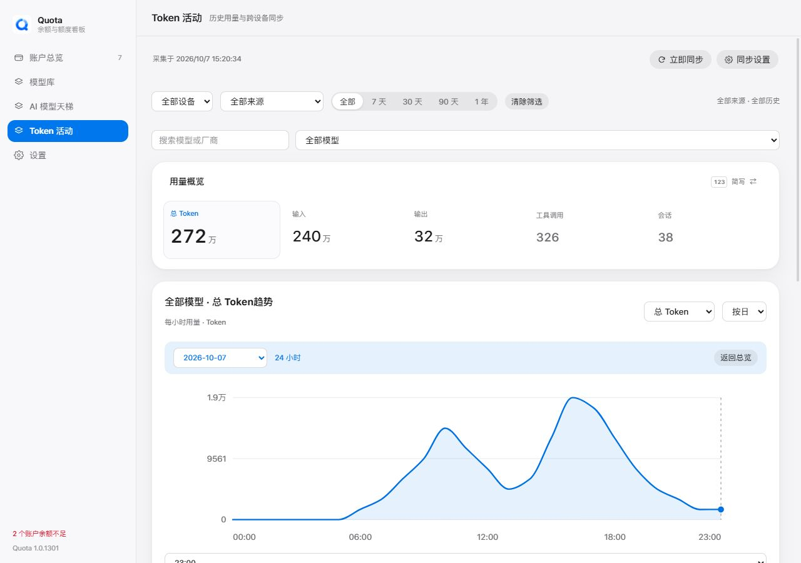
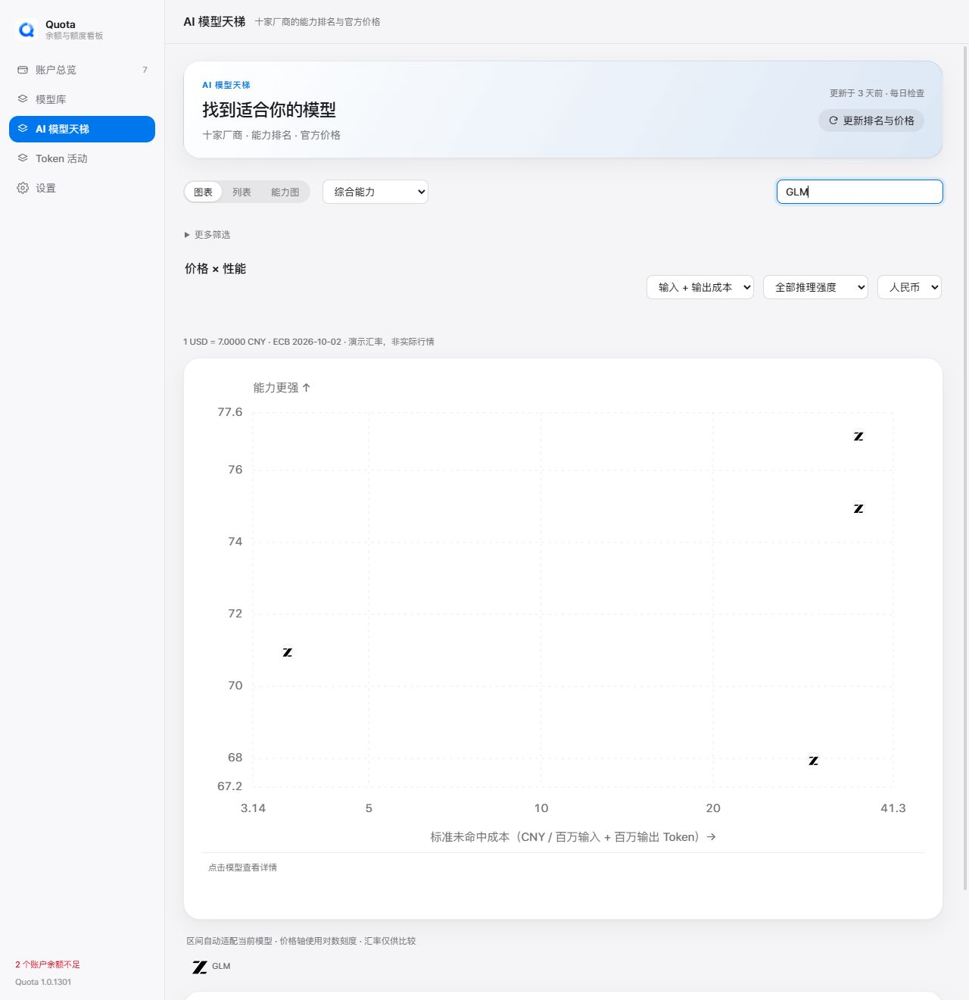

<p align="center">
  <picture>
    <source media="(prefers-color-scheme: dark)" srcset="assets/readme/hero-dark.svg">
    
  </picture>
</p>

Quota 是一个本地优先的 AI 用量桌面看板。将账户余额、订阅额度、模型价格和 Token 活动放进同一个窗口，减少在多个服务商控制台之间切换。

**Windows 10+ · macOS Apple Silicon 构建支持 · Tauri 2 + Rust + React · 浅色 / 深色模式**

[功能](#功能) · [支持账户](#支持账户) · [开始使用](#开始使用) · [界面预览](#界面预览) · [数据与安全](#数据与安全) · [构建与开发](#构建与开发) · [文档](#文档)

## 功能

| 页面 | 能做什么 |
| --- | --- |
| **账户总览** | 查看余额、订阅余量、刷新状态和低余额提醒；累计充值、累计消费分别展示 |
| **模型库** | 查看模型资料、官方价格与来源，隐藏或恢复型号 |
| **AI 模型天梯** | 图表、列表、六维能力图；自适应价格与评分区间，筛选模型，点击查看能力、价格及推出日期 |
| **Token 活动** | 汇总 Codex、智谱 ZCode 和 DeepSeek Harness 用量；按设备、来源、模型或厂商筛选，查看小时曲线与缓存命中情况 |
| **设置** | 调整刷新、采集频率、通知和共享目录同步，导出备份并选择导入内容 |

### 模型天梯

- 价格与性能图按当前模型自动选择坐标区间，搜索、分类、价格类型和币种变化后重新适配；所有当前可比较型号保留。
- 能力图最多对比三个模型，展示综合、编程、数学、科学、推理、智能体六个维度；缺失评分留空。
- 点击模型查看能力卡片、标准输入 / 缓存命中 / 输出价格和推出日期。没有可核实资料时显示未知。
- 账户、模型库和天梯共用本地品牌资源，不加载远程图标。

排名和能力评分来自 AITier；价格仅接受厂商官方标准档，保留来源、单位、条件和核实时间。十家厂商的确定性价格表可自动核实，结构或型号不明确时不猜数字。模型库中的启发式候选仍需人工采用。详见 [模型资料库规则](docs/model-catalog.md)。

### Token 活动

- 默认显示全部历史，可切换 7 天、30 天、90 天、1 年。
- 概览保持五项等宽，支持完整数字与万 / 亿简写；完整数字不换行，空间不足时自动调整字号。
- **总览**查看每日汇总；**按日**直接查看所选日期的 24 小时变化；按周、按月展示具体周次和年月。
- 模型筛选既支持单一型号，也支持同一厂商的全部模型汇总。
- 输入指标可切换缓存命中与未命中；缓存表按模型颜色区分，展示命中率及对应 Token 数。

统计只使用保留的本地指标事件。缓存和推理属于输入 / 输出子项，不重复加入总 Token；统计不等于厂商账单或订阅剩余额度。详见 [活动统计与同步](docs/activity-stats.md)。

## 支持账户

添加账户当前展示以下六种类型，账户适配范围与模型天梯的厂商范围分别维护。

| 账户类型 | 查看内容 | 连接方式 |
| --- | --- | --- |
| DeepSeek | 余额 | API Key |
| Kimi / Moonshot | 余额 | API Key |
| 智谱 GLM | 余额 | API Key；使用未收录于官方文档的账户报表接口 |
| 小米 MiMo 按量 | 余额、本月用量 | 隔离的官方登录窗口 |
| 小米 MiMo 订阅 / Token Plan | 套餐余量、本月用量 | 官方登录，可复用按量账户连接 |
| ChatGPT 订阅 | Codex 短期与每周额度 | 显式连接本机 Codex 登录 |

**ChatGPT 展示的是订阅内 Codex 额度，不是网页聊天额度。** Quota 不复制或刷新 Codex token。接口能力取决于服务商与账户权限；查询失败时可重试、打开官网或改用手动余额。

官方未提供的累计充值、累计消费保持未知，可在高级设置补全，不根据余额反算。余额趋势只反映已记录数据，耗尽时间为估算。其他供应商定义部分保留在代码中，当前不展示在添加列表。详见 [供应商能力](docs/providers.md)。

## 开始使用

1. 在「账户总览」添加账户：选择平台 → 填入 API Key 或连接登录 → 保存。账户名称可选，其他参数收进「高级设置」。
2. 在「Token 活动」点击「立即同步」，读取本机已有的活动记录；DeepSeek Harness 需配置持久化日志目录。
3. 按需开启自动采集、低余额提醒、备份或共享目录同步。单击系统托盘可打开主窗口。

充值与订阅入口只打开官方页面，Quota 不经手支付。

### 当前版本与安装包

当前源码版本为 **1.0.1301**，已生成 Windows NSIS 本地安装包。版本、WebView2Loader.dll 哈希及解包后的隔离配置启动检查通过；**实际覆盖升级未验证**。本轮 macOS 安装包未构建。

安装包不存入 Git 仓库，本地构建不代表公开发布。公开下载以 [Releases](https://github.com/Sharanie0612/Quota/releases) 中实际提供的文件为准，也可按下文从源码构建。较早的 Apple Silicon 本地 DMG 交付记录见 [1.0.1000 说明](docs/release-1.0.1000.md)；未做 Developer ID 签名或公证，不能将旧包验收结果视为当前版本的验证。

## 界面预览

以下截图由 1.0.1301 前端在浏览器中渲染，使用合成账户、用量与汇率数据，不代表真实账户查询结果。

### 账户总览



### Token 小时趋势



### 自适应模型天梯



## 备份与跨设备同步

在「设置 → 备份与迁移」使用统一导出 / 导入入口。默认导出不含登录信息的 JSON；勾选「包含登录信息」并设置密码后生成加密备份。

| 格式 | 内容与用途 |
| --- | --- |
| **普通 JSON** | 账户资料、设置、模型资料、隐藏列表、余额历史、Token 指标；省略密钥、Cookie、备注、自定义请求、连接 URL 和本机路径 |
| **加密备份** | 另含完整账户配置和凭据库中的 API Key、AccessKey、管理密钥、小米 Cookie；不包含 Codex token，恢复需要原密码 |

导入前可预览并逐账户、逐类别选择；按账户 ID 合并，未选内容保留，历史和活动去重。新设备可能需要重新连接小米或本机 Codex，并重新设置日志路径与共享目录。加密备份采用 AES-256-GCM 和 PBKDF2-HMAC-SHA256，详细范围与兼容规则见 [数据迁移](docs/data-migration.md)。

跨设备同步需在各设备选择同一个 iCloud Drive、OneDrive 或 NAS 文件夹。可交换 Token 指标及账户展示资料，不包含登录凭据、连接 URL、自定义请求、备注或原始响应；新设备需独立配置登录信息才能主动查询。目录传输由已有云盘客户端或 NAS 完成，Quota 不猜测路径，也不确认文件已上传云端。详见 [账户共享同步](docs/account-sync.md)。

自动采集间隔可选 5 秒至 15 分钟，默认 30 秒，可关闭；仅在应用运行时执行。共享目录交换最低间隔为 5 分钟。Token 事件按独立设备 UUID 去重，账户快照不累加；删除账户仅影响本机。

## 数据与安全

- 配置和统计保存在本机：Windows 为 `%APPDATA%\Quota\`，macOS 为 `~/Library/Application Support/Quota/`。
- API Key、AccessKey、管理密钥、小米 Cookie 使用系统凭据库的 `Quota` 服务：Windows 凭据管理器 / macOS Keychain。用户主动导出的加密备份可包含凭据；macOS 真实凭据读写尚未完成实机验收。
- **自定义接口请求头与请求体会写入 `config.json`，不受凭据管理器保护。不要在这些字段填写密钥。**
- 活动采集保存指标，不保存对话正文、工具参数或凭据。查询余额、获取排名和核实价格会访问对应服务；共享目录同步需主动开启。
- 从旧版 AgentPrice 升级时，仅复制新位置缺失的数据及所需凭据，旧数据保留。

详见 [安全规则](docs/security.md)。

## 构建与开发

需 Node.js、Rust stable 及对应平台的 Tauri 构建依赖。

```powershell
git clone https://github.com/Sharanie0612/Quota.git
Set-Location Quota
npm ci
npm run tauri dev
```

未合入默认分支的功能需先切换到相应任务分支。前端使用 Vite，Tauri 开发端口为 1420。

### Windows

本仓库使用 `stable-x86_64-pc-windows-gnu` 工具链及 WebView2。打包前退出构建产物位置正在运行的 `quota.exe`，使用 rustup 自带 MinGW，避免系统中的旧 MinGW：

```powershell
$env:Path = "$env:USERPROFILE\.rustup\toolchains\stable-x86_64-pc-windows-gnu\lib\rustlib\x86_64-pc-windows-gnu\bin;$env:USERPROFILE\.cargo\bin;$env:Path"
npm run tauri build
```

产物：`src-tauri/target/release/quota.exe`（便携版）和 `src-tauri/target/release/bundle/nsis/`（安装包）。`WebView2Loader.dll` 必须随包携带；NSIS 工具链首次下载可能需要代理。详见 [Windows 构建](docs/build-windows.md)。

### macOS（Apple Silicon）

需 Xcode Command Line Tools。默认配置用于 Windows NSIS，Mac 构建需排除 Windows DLL 并指定 App / DMG：

```bash
npm ci
npm run tauri -- build --bundles app,dmg --config '{"bundle":{"resources":[],"macOS":{"signingIdentity":"-","hardenedRuntime":false}}}'
```

上述命令使用 ad-hoc 临时签名，不代表 Developer ID 签名或公证。App 位于 `src-tauri/target/release/bundle/macos/`，DMG 位于 `src-tauri/target/release/bundle/dmg/`；Intel / Universal 包暂无验收记录。详见 [macOS 构建与安装](docs/build-macos.md)。

### 验证

```powershell
npm run typecheck
npm run build
cargo check --manifest-path src-tauri/Cargo.toml
node scripts/verify-logic.cjs
node scripts/verify-ladder-plot.cjs
node scripts/verify-activity-charts.cjs
node scripts/verify-ui-render.cjs
cargo run --release --manifest-path src-tauri/Cargo.toml --example activity_checks
```

本机 Windows GNU 环境的 `cargo test` 有 WinRT DLL 加载限制，使用 Rust example 与纯逻辑脚本验证。浏览器 UI 预览可运行 `node scripts/prepare-preview.cjs` 和 `node scripts/preview-server.cjs 4174`，随后访问 `http://127.0.0.1:4174/`；使用合成数据。

纯文档修改不递增产品版本。版本展示号、任务分支与 PR 集成规则见 [AGENTS.md](AGENTS.md) 和 [Git 分支规范](docs/git-workflow.md)。

## 文档

| 文档 | 内容 |
| --- | --- |
| [自适应天梯区间](docs/ui-1301.md) | 最新坐标规则、验证及交付边界 |
| [小时趋势与天梯布局](docs/ui-1300.md) | 小时入口、日期交互与图表留白 |
| [Token 活动与同步](docs/activity-stats.md) | 统计口径、历史范围与去重协议 |
| [模型资料库](docs/model-catalog.md) | 官方价格来源与核实纪律 |
| [供应商能力](docs/providers.md) | 查询方式与接口限制 |
| [账户同步](docs/account-sync.md) | 无凭据共享与快照合并规则 |
| [数据迁移](docs/data-migration.md) | 导出范围、选择导入与迁移边界 |
| [架构](docs/architecture.md) | 前端调用链、命令与 Rust 模块 |
| [安全规则](docs/security.md) | 凭据存储、自定义接口与旧版兼容 |
| [开发指南](docs/development.md) | 开发运行与专项验证 |

历史交付文档记录当时的行为与验收，不代表当前版本已验证或公开发布。

## 贡献与许可

提交前请阅读 [贡献指南](CONTRIBUTING.md)。PR 应说明用户可见变化、验证结果与兼容限制；不要提交凭据、个人配置、真实账单或未经官方核实的价格。

项目尚未选择开源许可证。仓库公开可读不代表已授予修改或再分发许可；品牌资源的独立来源与许可见 [图标说明](src/assets/brands/README.md)。
